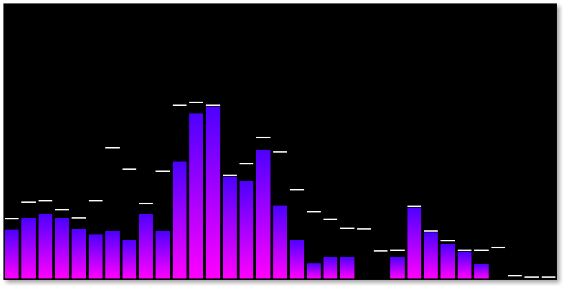
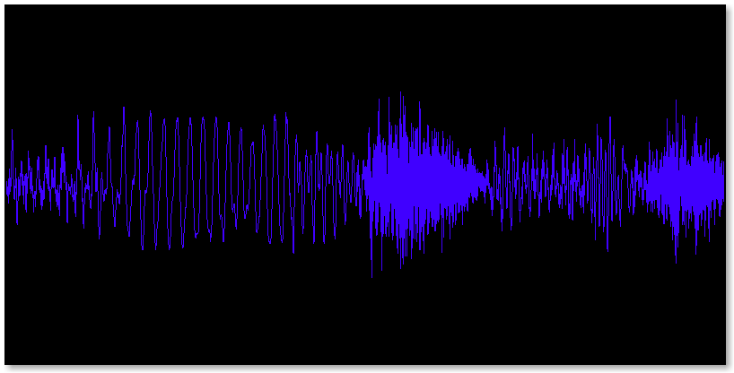
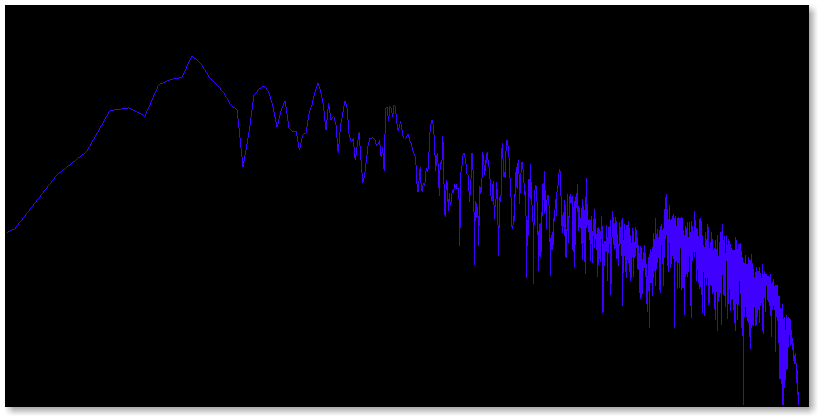

**pulseviz** is a small OpenGL-accelerated audio visualizer for PulseAudio written in Python.
Right now it's more or less a proof of concept with little to no features.

[](https://travis-ci.org/pckbls/pulseviz.py)



# Installation

pulseviz can be installed via `pip3`:

```sh
# System wide...
sudo pip3 install git+https://github.com/pckbls/pulseviz.py.git

# ...or only for the current user
pip3 install --user git+https://github.com/pckbls/pulseviz.py.git
```

# Usage

pulseviz requires you to choose an audio source and a visualizer type:

```
$ pulseviz
Usage: pulseviz <source> <visualizer>

Available sources:
    alsa_output.pci-0000_00_1b.0.analog-stereo.monitor
    alsa_input.pci-0000_00_1b.0.analog-stereo
    alsa_output.usb-VIA_Technologies_Inc._USB_Audio_Device-00.iec958-stereo.monitor

Available visualizers:
    waveform
    spectrum
    bands
```

By default PulseAudio automatically creates a monitor source for each sink which can be used to visualize the audio that you are hearing.
Those sources have a `.monitor` suffix.

# Visualizations

## Waveform Visualizer

The waveform visualizer shows the raw audio signal in the time domain.



## Spectrum Visualizer

The spectrum visualizers transforms the audio signal into the frequency domain using a [STFT](https://en.wikipedia.org/wiki/Short-time_Fourier_transform).



## Octave Bands Visualizer

The octave bands visualizer divides the frequency domain magnitudes into [octave bands](https://en.wikipedia.org/wiki/Octave_band) and displays
the average magnitude of each band.


# Future goals

* Make visualizers configurable
  * Either via command line switches...
  * ...or via configuration file
* Stereo support
* Create more visually appealing visualiziations such as
  * [Spectrogram](https://en.wikipedia.org/wiki/Spectrogram#/media/File:Spectrogram-19thC.png)
  * Vectroscope/Stereometer for visualizing the correlation between multiple audio channels
  * [Kodi's rotating 3D Spectrum visualizer](http://kodi.wiki/view/File:Fullscreen_music_controls.png).
  * [Shadertoy](https://www.shadertoy.com/) visualization
  * [projectM](http://projectm.sourceforge.net/) visualization
* Further improve performance
  * By off-loading rendering tasks onto the GPU using shaders
  * By reducing unnecessary memory copies
  * Maybe by rewriting the DSP algorithms in C
* Implement a GUI
  * Most likely based on GTK3
  * Ship two applications `pulseviz` (the original CLI version) and `pulseviz-gtk`
* Something for the far distant future: Support more audio sub systems and platforms.
